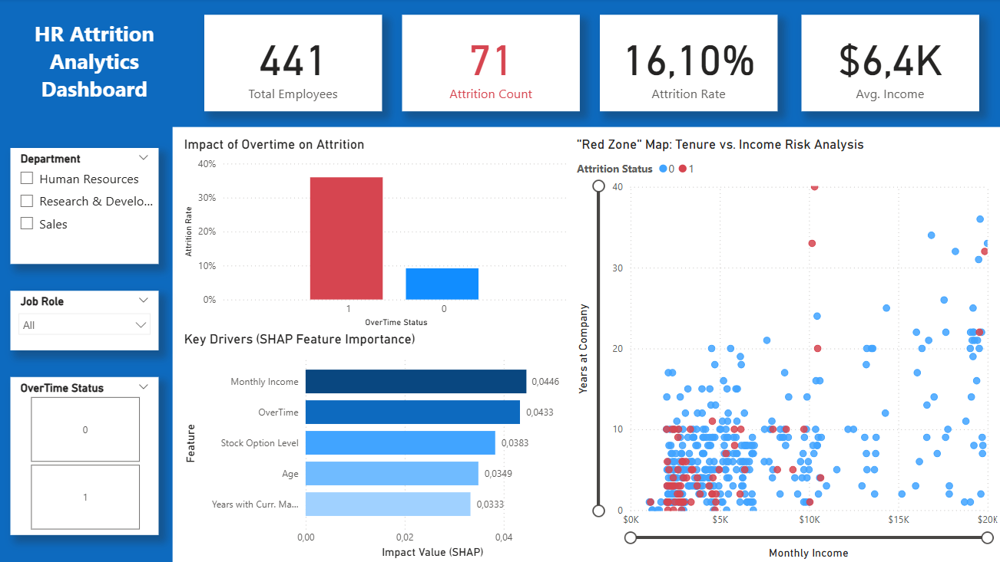
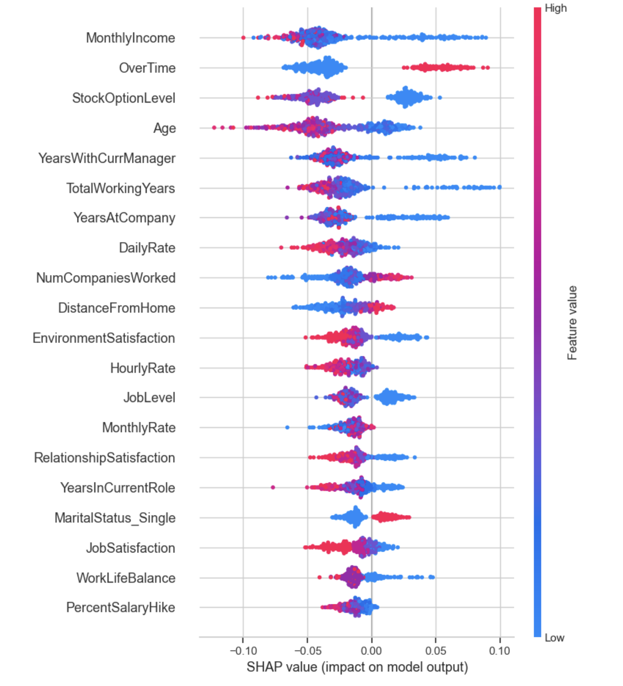
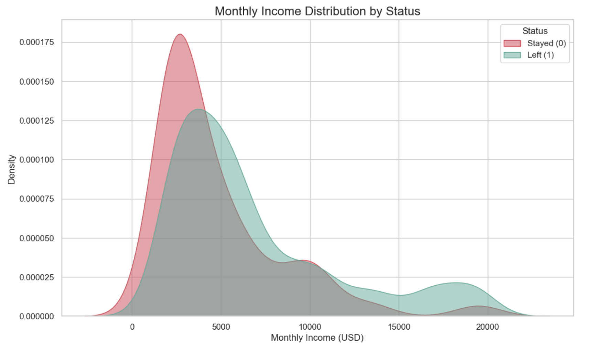
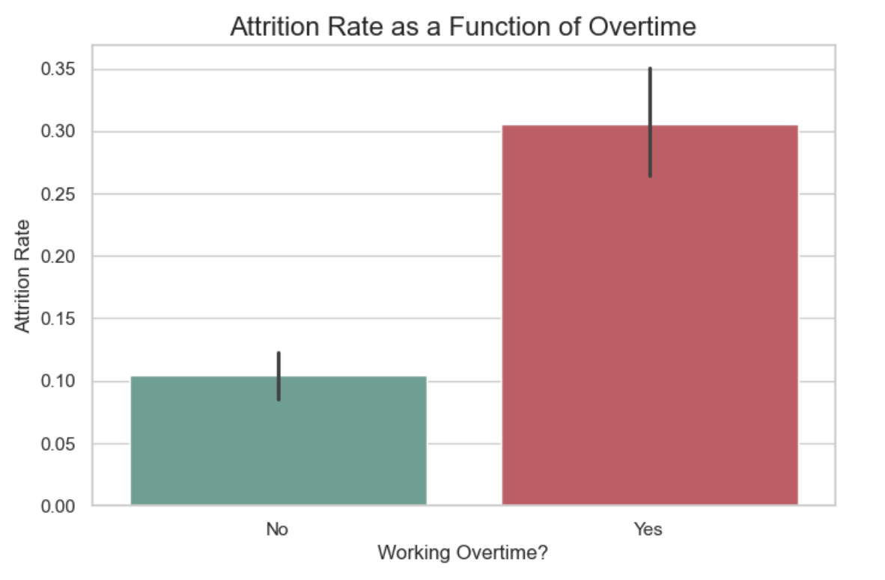

# 📊 HR Attrition Analytics & Decision Support System

## 🎓 About This Project
This repository contains the practical analysis and source code for my **Bachelor Thesis**: *"Data-Driven HR Decision Support: Predicting Employee Turnover with Machine Learning"*.

The goal was not just to build a model, but to create an interpretible **Decision Support System** that bridges the gap between complex algorithms and HR strategy, specifically adapted to the challenges of the **Hungarian labor market** (labor shortage, retention issues).

---

## 📉 The Business Problem
Employee turnover is costly. Traditional HR relies on intuition ("gut feeling"), but this project aims to transition to **Evidence-Based Management**.
* **Dataset:** IBM HR Analytics Employee Attrition & Performance (1,470 records).
* **Challenge:** Imbalanced dataset (only ~16% attrition), requiring specialized handling strategies.

---

## 🛠️ Data Science Methodology

### 1. Exploratory Data Analysis (EDA)
Before modeling, I identified key risk factors using statistical analysis:
* **The "First-Year Trap":** Attrition risk is highest in the first 1-2 years, highlighting critical failures in **onboarding processes**.
* **Role Hotspots:** *Sales Representatives* showed a critical attrition rate of ~40%.

### 2. Model Selection: The Precision-Recall Trade-off
I compared two models to solve the classification problem:
* **Logistic Regression:** High Recall (found most leavers) but low Precision (too many false alarms).
* **Random Forest (Selected):** Optimized with class weighting. While it had lower Recall, it achieved **high Precision (67%)**, making it a "surgical tool" for HR—identifying high-risk employees with minimal false positives.

### 3. Opening the "Black Box" (XAI)
Using **SHAP (SHapley Additive exPlanations)**, I translated the Random Forest's decisions into human-readable insights.

#### A. Global Drivers (The "Big Picture")
First, I identified what drives attrition across the entire company.
* **Monthly Income:** Low income is the #1 predictor.
* **Overtime:** A major risk factor.

#### B. Individual Risk Profiling (Real-world Case Study)
The model can also explain the specific reasons behind **one individual's** risk score.
* **Example:** *High Risk Employee* (Prediction: 54% probability of leaving).
* **Reasoning:** Despite having a good `JobSatisfaction`, the model flagged them because of **Low Income** (blue bar) and **Short Tenure** (blue bar).
* **Actionable Insight:** This allows HR to intervene proactively with a targeted salary adjustment or retention bonus.

---

## 🔍 Key Findings & Strategic Recommendations

Based on the model interpretation and the Hungarian market context, I formulated the following strategic recommendations:

### 💡 1. Rethink Compensation (Herzberg's Theory)
The analysis revealed a non-linear relationship between income and retention.
* **Finding:** Retention risk drops sharply as salary increases but plateaus around $7,000/month.
* **Recommendation:** Salary increases are vital up to a "hygiene threshold," but beyond that, other incentives (work-life balance, career growth) become more cost-effective.

### 🔥 2. Tackle the Burnout Crisis
* **Finding:** Employees working overtime are **3x more likely to leave**.
* **Recommendation:** Implement strict overtime monitoring. In the Hungarian SME context, where "hustle culture" is common, this is a primary driver of churn.

### ⚓ 3. Create "Long-Term Anchors"
* **Finding:** Stock Option Levels were a top 3 predictor for retention.
* **Adaptation:** Since Stock Options are rare in Hungarian SMEs, I recommend substituting them with **loyalty bonuses** or tenure-based benefits to simulate the same "anchoring" effect.

---

## 💻 Tech Stack
* **Language:** Python 3.x
* **Libraries:** Pandas, NumPy, Scikit-learn, Matplotlib, Seaborn, SHAP
* **Visualization:** Power BI (Interactive Dashboard)

## 📂 Repository Structure
* `Employee_Attrition_Prediction_with_ML_and_SHAP.ipynb`: End-to-end Python analysis.
* `HR_Attrition_Analytics_Dashboard.pbix`: Power BI file for executive reporting.
* `ibm_attrition_for_powerbi.csv`: Processed dataset.

---
*Created by csakig*
